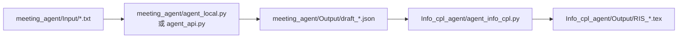

# BackEnd 使用说明

这个目录是一条两阶段的需求处理链路，用来把会议纪要转换成结构化需求，再生成 RIS 需求记录表的 LaTeX 草稿。

## 目录结构

```text
BackEnd/
├─ meeting_agent/
│  ├─ Input/                 # 输入的会议纪要 .txt
│  ├─ Output/                # 第一阶段输出的 JSON
│  ├─ agent_local.py         # 本地规则版，不调用模型
│  └─ agent_api.py           # DeepSeek API 版，调用模型抽取 JSON
├─ Info_cpl_agent/
│  ├─ Output/                # 第二阶段输出的 .tex
│  ├─ template.tex           # LaTeX 模板
│  └─ agent_info_cpl.py      # 读取 JSON，生成需求文档 LaTeX
└─ requirements.txt          # Python 依赖
```

## 工作流



## 你需要先准备什么

1. 安装 Python 依赖。
2. 把会议纪要保存成 `.txt` 文件，放进 `meeting_agent/Input/`。
3. 如果要走模型版，确认 `agent_api.py` 和 `agent_info_cpl.py` 里的 `DEEPSEEK_API_KEY` / `API_KEY` 可用。

## 安装依赖

在 `BackEnd` 目录下执行：

```powershell
cd E:\DeliveraX\BackEnd
python -m pip install -r requirements.txt
```

## 怎么调用

### 方案 A：先用本地规则版生成 JSON

这个方式不请求 DeepSeek，适合先验证目录、输入输出和整体流程。

```powershell
cd E:\DeliveraX\BackEnd
python .\meeting_agent\agent_local.py
```

运行后会读取：

- `meeting_agent/Input/*.txt`

并生成：

- `meeting_agent/Output/draft_meeting_note1.json`
- `meeting_agent/Output/draft_meeting_note2.json`

### 方案 B：用 DeepSeek API 版生成 JSON

这个方式会请求模型，抽取结果通常比本地规则版更完整。

```powershell
cd E:\DeliveraX\BackEnd
python .\meeting_agent\agent_api.py
```

输入输出目录和本地版相同：

- 输入：`meeting_agent/Input/*.txt`
- 输出：`meeting_agent/Output/draft_*.json`

### 第二阶段：根据 JSON 生成 LaTeX 需求文档

不管第一阶段用的是本地版还是 API 版，只要 `meeting_agent/Output/` 里已经有 `draft_*.json`，就可以运行第二阶段：

```powershell
cd E:\DeliveraX\BackEnd
python .\Info_cpl_agent\agent_info_cpl.py
```

它会读取：

- `meeting_agent/Output/*.json`
- `Info_cpl_agent/template.tex`

并生成：

- `Info_cpl_agent/Output/RIS_draft_meeting_note1.tex`
- `Info_cpl_agent/Output/RIS_draft_meeting_note2.tex`

## 推荐调用顺序

日常使用建议按下面顺序：

```powershell
cd E:\DeliveraX\BackEnd
python .\meeting_agent\agent_api.py
python .\Info_cpl_agent\agent_info_cpl.py
```

如果你只是想先验证流程是否通，再换成：

```powershell
cd E:\DeliveraX\BackEnd
python .\meeting_agent\agent_local.py
python .\Info_cpl_agent\agent_info_cpl.py
```

## 第一阶段 JSON 长什么样

第一阶段现在统一输出标准 schema，顶层字段固定为：

- `project_info`
- `business`
- `scene`
- `requirements`
- `risks`
- `notes`

其中最关键的是：

- `project_info`：项目名、客户、日期、责任人、干系人、变更记录
- `scene`：地点、场景类型、重点区域、约束条件
- `requirements`：摘要、功能需求、KPI、接口资料、下一步计划

第二阶段默认就按这套 schema 去补全和生成 LaTeX。

## 输入文件格式建议

`meeting_agent/Input/` 里的文本建议至少包含下面这些信息，命中率会更高：

- `会议主题：...`
- `时间：...`
- `参会人员：...`
- `会议内容记录：...`
- `下一步计划：...`

现有示例可参考：

- [meeting_note1.txt](/E:/DeliveraX/BackEnd/meeting_agent/Input/meeting_note1.txt)
- [meeting_note2.txt](/E:/DeliveraX/BackEnd/meeting_agent/Input/meeting_note2.txt)

## 产物说明

- `draft_*.json`
  第一阶段结构化需求草稿，可以先人工检查再继续。
- `RIS_*.tex`
  第二阶段生成的 LaTeX 文档草稿，适合继续排版或编译 PDF。

## 注意事项

- 这套流程现在默认按脚本相对路径找文件，所以建议直接在 `BackEnd` 目录执行命令。
- 如果输入文件名重复，输出文件会按同名规则覆盖。
- `agent_local.py` 不依赖网络，适合联调。
- `agent_api.py` 和 `agent_info_cpl.py` 会请求 DeepSeek。
- 第二阶段当前输出是 `.tex`，不会自动编译成 PDF。

## 最短使用路径

如果你只想最快跑通一次：

```powershell
cd E:\DeliveraX\BackEnd
python .\meeting_agent\agent_local.py
python .\Info_cpl_agent\agent_info_cpl.py
```

跑完后重点看两个目录：

- `meeting_agent/Output/`
- `Info_cpl_agent/Output/`
