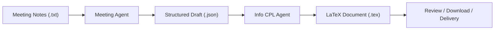

<div align="center">
  <h1>DeliveraX</h1>
  <p><strong>From meeting notes to delivery-grade documents.</strong></p>
  <p>
    一个面向 <strong>需求梳理 -> 信息补全 -> 文档交付</strong> 的 AI 协作原型，
    将零散会议纪要沉淀为结构化需求草稿，并进一步生成可交付的 LaTeX 文档。
  </p>
  <p>
    
    
    
    
    
  </p>
</div>

## Overview

DeliveraX 的核心目标不只是“再做一个 Agent Demo”，而是把真实交付链路里的信息损耗降下来。

在典型的售前、方案和实施协作中，团队常常会遇到这些问题：

- 会议纪要是非结构化文本，后续很难复用。
- 需求草稿依赖人工整理，速度慢且容易遗漏。
- 交付文档生成过程黑盒化，团队无法追踪中间产物。

DeliveraX 用一个可视化工作台把这条链路串起来，让每一步都有输入、有产出、可预览、可回看。

## What Makes It Valuable

- **Structured from day one**: 上传 `.txt` 会议纪要后，系统会先生成标准化 `draft_*.json`，而不是直接跳到最终文档。
- **Human-in-the-loop**: 中间结果可查看、可下载，适合人工审核和修正，而不是一键黑盒输出。
- **Dual execution modes**: 核心 Agent 同时支持本地规则模式和 API 模式，便于离线演示与在线增强。
- **Delivery-oriented**: 最终产物不是聊天记录，而是更接近真实交付场景的 `.tex` 文档。

## End-to-End Flow



这条链路对应的是一个非常明确的产品思路：

`会议输入 -> 结构化抽取 -> 信息补全 -> 文档输出 -> 人工审核`

## Product Surface

### Frontend

前端位于 [`FrontEnd`](./FrontEnd)，基于 `React + Vite + TypeScript + Tailwind CSS`，提供一个偏产品化的工作台界面，覆盖：

- 项目列表与阶段切换
- 会议纪要上传
- Meeting Agent / Info CPL Agent 触发
- 中间文件与最终文件预览
- 任务状态追踪

主入口：

- [`FrontEnd/src/main.tsx`](./FrontEnd/src/main.tsx)
- [`FrontEnd/src/App.tsx`](./FrontEnd/src/App.tsx)

### Backend

后端位于 [`BackEnd`](./BackEnd)，基于 `FastAPI`，承担文件管理、任务调度、结果回传和静态预览能力。

核心能力包括：

- 项目与阶段查询
- 会议纪要上传
- Agent 任务创建与轮询
- JSON / TeX 文件内容预览
- 文件下载

服务入口：

- [`BackEnd/service/main.py`](./BackEnd/service/main.py)

### Agents

当前包含两类核心 Agent：

- `Meeting Agent`
  将会议纪要抽取为结构化需求草稿 `draft_*.json`
- `Info CPL Agent`
  基于结构化草稿补全文档信息，并生成 `RIS_*.tex`

两者都保留了“可展示中间产物”的设计，这一点对演示和交付都很重要。

## Architecture Snapshot

| Layer | Responsibility | Key Stack |
| --- | --- | --- |
| Experience Layer | 项目工作台、文件预览、任务状态反馈 | React, Vite, TypeScript, Tailwind |
| Service Layer | API 编排、文件管理、任务调度 | FastAPI, Pydantic |
| Agent Layer | 会议抽取、信息补全、LaTeX 生成 | Local rules / DeepSeek API |
| Output Layer | 草稿 JSON、LaTeX 文档、可下载资产 | JSON, TeX |

## Demo Journey

如果你要在最短时间内演示 DeliveraX，可以按下面这条路径走：

1. 进入项目工作台，选择一个项目和阶段。
2. 上传一份 `.txt` 会议纪要。
3. 运行 `Meeting Agent`，生成结构化 `draft_*.json`。
4. 在界面中预览 JSON 草稿，确认关键信息是否完整。
5. 运行 `Info CPL Agent`，生成最终 `.tex` 文档。
6. 预览或下载产物，完成演示闭环。

这条路径的重点不是“模型有多强”，而是“链路是否闭环、过程是否透明、产物是否可交付”。

## Quick Start

### 1. Start the backend

在 [`BackEnd`](./BackEnd) 目录下执行：

```powershell
cd E:\DeliveraX\BackEnd
python -m pip install -r requirements.txt
uvicorn service.main:app --reload
```

默认服务地址：

- `http://127.0.0.1:8000`

如果你希望启用 API 模式，请先配置：

```powershell
$env:DEEPSEEK_API_KEY="your_api_key"
```

### 2. Start the frontend

在 [`FrontEnd`](./FrontEnd) 目录下执行：

```powershell
cd E:\DeliveraX\FrontEnd
npm install
npm run dev
```

默认访问地址：

- `http://127.0.0.1:5173`

## Repository Layout

```text
DeliveraX/
|-- FrontEnd/                  # React-based project workspace
|   |-- src/App.tsx            # Main workbench UI
|   `-- package.json
|-- BackEnd/
|   |-- service/main.py        # FastAPI service entry
|   |-- meeting_agent/         # Meeting note -> draft JSON
|   `-- Info_cpl_agent/        # Draft JSON -> LaTeX document
|-- .github/workflows/         # Frontend deployment workflow
`-- README.md
```


